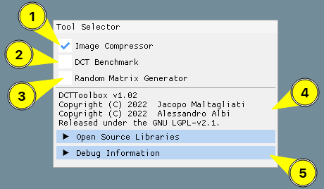
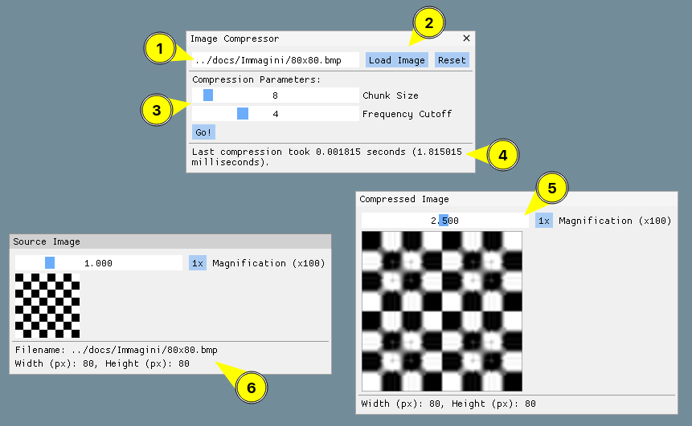
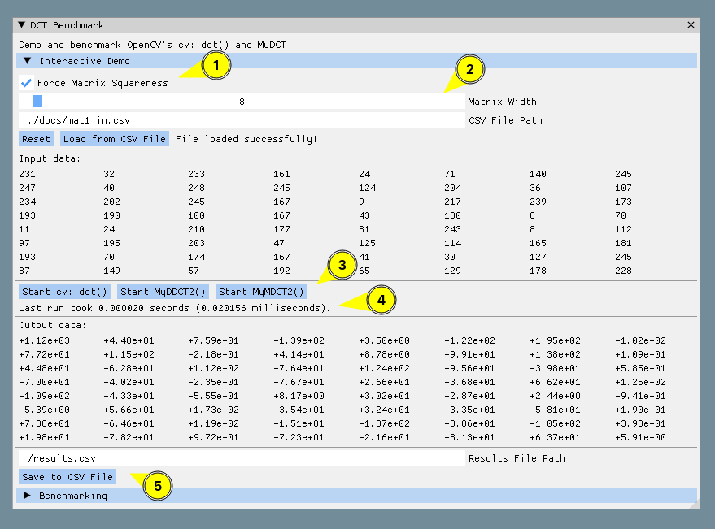
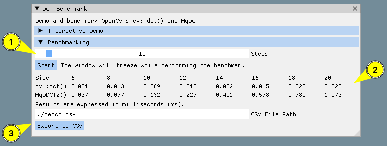
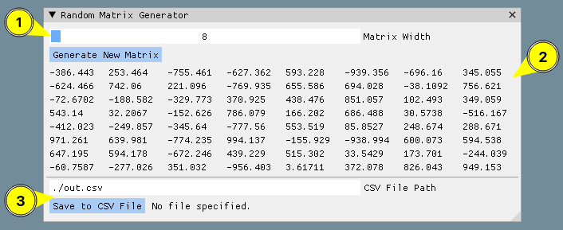
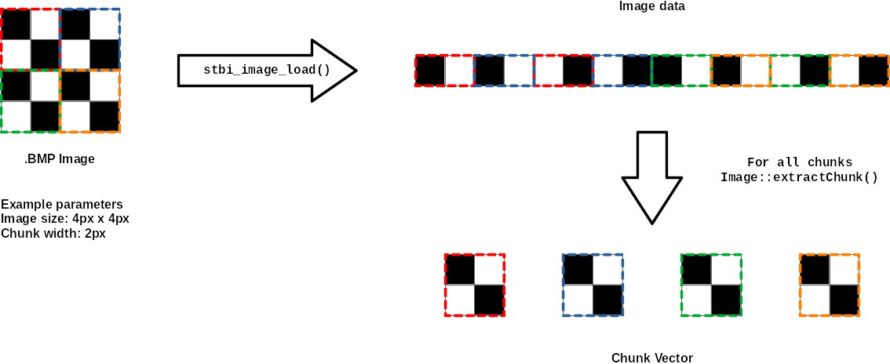
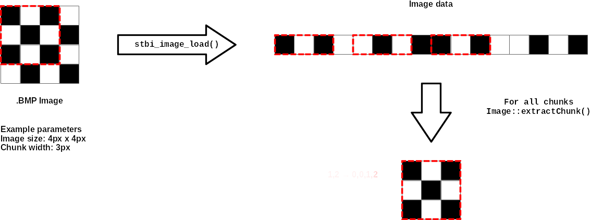
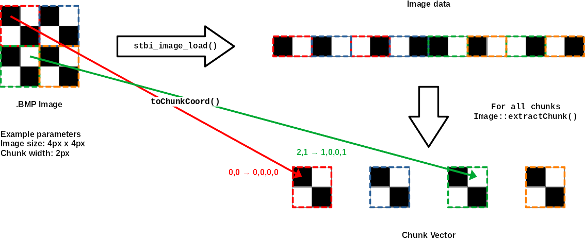
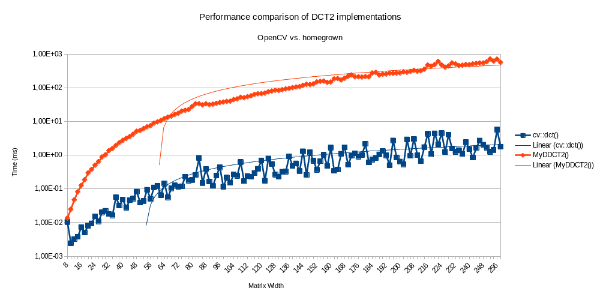

---
header-includes:
    - \setmainfont{CMU Serif}
    - \setsansfont{CMU Sans Serif}
    - \setmonofont{CMU Typewriter Text}
    - \usepackage{pifont}
    - \usepackage{hyperref}
    - \hypersetup{colorlinks=true}
---

# F1801Q128-DCT

Authors:

- Jacopo Maltagliati - 830110
- Alessandro Albi - 817769

Project for the course "Methods for Scientific Computing": comparison of an homegrown DCT implementation with the one included in OpenCV and implementation of a grayscale bitmap image compressor using OpenCV.

\newpage

## DCTToolbox

DCTToolbox is a graphical application implemented using _Dear ImGui_, an immediate mode graphical user interface library that is widely used for writing fast and unobtrusive interfaces. The application is built against ImGui v1.88 using SDL2 and OpenGL 2 as its backend and rendering library. Additionally, we have chosen to include the OpenCV library, used to deal with matrices and images and to perform the fast DCT-II and DCT-III transforms, the _stbi_image_ library, used to load data from bitmaps since it's already been tested extensively with ImGui, and the _rt-app_ project, which includes a timing function that has been developed by one of the authors and has been successfully used to measure the scheduling jitter of a real-time workload with very high precision.

### Prerequisites

While ImGui, stbi_image and rt-app are included as submodules and built along with the project, the other libraries are fetched by CMake from the target. Please make sure you have the following installed before attempting to use DCTToolbox:

- OpenCV >= 4.5.3
- SDL 2 >= 2.0.22
- OpenGL 2 

Different versions of those libraries might or might not work.

### Building

To build the project from scratch you'll need:
 
- the `git` version control system,
- the CMake and GNU Make build systems,
- the GNU Compiler Collection (specifically the `g++` compiler).

Once you have installed those packages using your preferred distribution's package manager, you can issue the following commands to fetch the source code and build the application:

```
git clone https://gitlab.com/jack23247/f1801q128-dct
cd f1801q128-dct
cd deps && ./mkdeps && cd ..
cmake .
make
```

This will produce an executable called `proj2` in the project's root folder.

\newpage

## GUI Layout

### Tool Selector

When launching `proj2` the user will be presented with a gray-ish window containing a smaller window called "Tool Selector": this is the main window of the application, from where several tools can be chosen.



#### Image Compressor Checkbox \ding{172}

Shows the "Image Compressor" tool, that allows the user to select a grayscale bitmap image to compress using OpenCV's ``cv::dct()``.

#### DCT Benchmark Checkbox \ding{173}

Shows the "DCT Benchmark" window, where the user can try both ``cv::dct()`` and ``MyDCT2`` on the contents of a CSV file, and perform a benchmark on randomly generated matrices and output the results to a different CSV file.

#### Random Matrix Generator Checkbox \ding{174}

Shows the "Random Matrix Generator" window, where the user can generate and export random matrices to a CSV file.

#### Information Section \ding{175}

This section contains various informations regarding DCTToolbox, such as the version of the application, the licenses and authors of the libraries (under the "Open Source Libraries" collapsible section) that have been used and ImGui's performance metrics (under the "Debug Information" collapsible section \ding{176}).

### Image Compressor

This window allows the user to load a non-compressed grayscale Bitmap image (via `stbi_image_load()`) on which to perform the DCT compression. 



The user must specify a filename in the appropriate dialog \ding{172} and press the **Load Image** button \ding{173} to invoke `stbi_image_load()`. At this point, the Compression Parameters section \ding{174} will be shown, allowing the user to adjust the chunk size and the cutoff. Upon clicking the **Go!** button, the image will be compressed and the result will be shown in the appropriate window, while the time it took to perform the compression will be shown in a dedicated section \ding{175} in the main window. The image windows allow the user to zoom the image with a slider \ding{176} and show informations about the image in a dedicated section \ding{177}.

### DCT Benchmark

This window allows the user to demonstrate the functionality of both `cv::dct()` and the functions provided by us (implemented in `my_dct.cpp`) on matrices loaded from CSV files. The results can then be exported to a CSV file to load them into an external editor.

#### The Interactive Demo Section

This section contains a number of tools used to demonstrate the functionality of the DCT implementations: it was originally created to aid with the integration of ImGui with the tools provided by OpenCV and our own logic and has been subsequently left in the application.



The user can select whether they want to force the loaded matrix to be square \ding{172}: in this case, only the slider for the width \ding{173} will be shown. The user must then supply the program with the path to a valid CSV (Comma-Separated Values) file holding the input data: at this point, by **Load from CSV File** button, the user will command the program to attempt to load the matrix contained in the file. If the specified width is wrong, an error message will be printed and the user will be able to select and load a different file, or change the width (or the height, if it's not square).

After loading a matrix, the user will be able to select which DCT implementation they want to run on the sample data with the **Start...** buttons \ding{174}. While the `cv::dct()` can be applied on any even-sized input, the `MyDDCT2()` will only work on square matrices, while the `MyMDCT2()` will only work on single rows ($1\times n$ sized matrices). The runtime of the operation will then be printed below the buttons \ding{175} and the output data will be shown, along with a prompt that lets the user save it to a CSV file \ding{176}. 

#### The Benchmarking Section

Moreover, in the Benchmarking section, a benchmark can be performed by running the algorithms on several, randomly generated, matrices of growing size.




### Random Matrix Generator

This window allows the user to generate random square matrices of varying size and export them to CSV for further processing. This tool has been created to aid with the development of the Benchmarking tool and has been subsequently left in the application.



A slider \ding{172} allows the user to decide how wide the matrix should be (only square matrices are supported for now). Upon hitting the **Generate New Matrix** button, the matrix will be displayed in the main section of the window \ding{173} (provided it's less than 64 columns wide) and can be subsequently exported to a file using the dedicated input box \ding{174}.

\newpage

## Compressing an image

Compressing an image is not an easy feat: due to how data is laid out differently between each library, several intermediate steps are required: the data must be copied from a C-style array to a `cv::Mat` for compression, and intermediate C++-style `std::vector`s are used in between for convenience. As stated earlier, the user can specify both the _Chunk Size_ ($F$) and _Frequency Cutoff_ ($d$) parameters that will be used to perform the compression: those are also fundamental to the compression process, as a number of steps depend directly on them, and the quality of the result depends directly on them.

#### The compression process

Upon clicking the **Go!** button in the compression window, the program will subdivide the image in as many $F\times F$ sized chunks as possible. This is done by iterating on the `Image::extractChunk()` method, that maps the coordinates of the chunk into the array holding the raw image data as loaded by `stbi_image_load()` and produces an `std::vector` containing just the data associated with the current chunk.



If it's not possible to subdivide the image exactly, any excess data will be discarded and won't be used to perform the DCT and reconstruct the image.



\newpage

The chunks are then converted into OpenCV-compatible matrices on which the forward DCT transform (DCT-II) is performed. At this point, the frequencies below the diagonal identified by $d$ are cut using the following logic:

```c++
for (int row = 0; row < chunk_width; row++) {
		for (int col = 0; col < chunk_width; col++) {
		    if ((col + row) >= diag_cut)
				mat2.at<double>(row, col) = .0f;
		}
}
```

...then the inverse DCT transform (DCT-III) is applied to each chunk and the chunks are reassembled by iterating on them and copying the data to an array containing the resulting image. The mapping between the chunk and the vector is performed by the `toChunkCoord()` function, that takes a tuple of coordinates in the image space and maps them onto a specific chunk.



Ultimately, mapping to and from a set of 2D coordinates $(x,y)$ and an offset $i$ in the array containing the raw image data is performed with the formula $i=y+(x\cdot w)$, where $w$ is the width of the image.

\newpage

## Benchmarking

These files contain the homegrown $n^3$ implementation of the DCT against which the fast implementation provided by OpenCV is benchmarked.

### OpenCV's `cv::dct()`

Developed by Intel and Willow Garage, OpenCV is the golden standard in open-source Computer Vision libraries. Officially launched in 1999, this library has been extensively used in countless commercial and research projects involving robotics, machine vision and machine learning. OpenCV technically supports CPU acceleration via SIMD extensions and GPU acceleration via OpenCL and CUDA.

OpenCV was selected amongst other libraries because of its excellent documentation, rich history, and ease of integration with CMake. Moreover, OpenCV is written in C++, meaning we could natively leverage the `cv::Mat` class which provides a fast and featureful implementation of matrices with a specific focus on storing image data, and `cv::dct()`, a fast implementation of the DCT (both II and III) which was extensively used.

The DCT transform is part of the Core functionality of OpenCV and is documented here: 

> [docs.opencv.org/3.4/d2/de8/group__core__array](https://docs.opencv.org/3.4/d2/de8/group__core__array.html#ga85aad4d668c01fbd64825f589e3696d4)

The documentation for `cv::Mat` can be found here: 

> [docs.opencv.org/3.4/d3/d63/classcv_1_1Mat](https://docs.opencv.org/3.4/d3/d63/classcv_1_1Mat.html)

<!-- Explain how cv::dct() works -->

### `my_dct.{cpp,h}`

This is a simple homegrown implementation of the DCT that was fast to implement and is extremely easy to understand. The goal of `MyDCT` is being as close as possible to the underlying mathematical principles, thus avoiding any complicated (yet rewarding) optimization. `MyDCT` operates with three nested loops onto the matrix (cols$\times$cols$\times$rows), thus being asymptotically equivalent to $n^3$.

> Portions of the following sections are automatically generated by Doxygen from the comments contained in the source files.

#### `MyDCTCoeff()`

Computes the coefficients for the transform. The DC (Direct Coefficient) is the average value of the sample sequence and is applied to the first waveform, while the AC (Indirect Coefficients) are applied to other waveforms. This is the step that is leveraged by the JPEG standard via carefully crafted coefficient matrices to efficiently compress the Blue and Red Chrominance channel in a YCbCr image with minimal loss of quality.

##### Parameters  

|     |                             |
|-----|-----------------------------|
| u   | The current waveform index. |
| N   | The input vector's width.   |

##### Returns  
The AC or DC.

##### Source
```c++
inline double MyDCTCoeff(unsigned u, unsigned N) {
    if (u == 0) {
		return (sqrt(1 / (double)N));
    } else {
		return (sqrt(2 / (double)N));
    }
}
```

#### `MyDCTSum()`

Computes a singular DCT sum.

##### Parameters  

|     |                                                               |
|-----|---------------------------------------------------------------|
| in  | The input row.                                                |
| u   | The current waveform index (aka the row of the input matrix). |
| n   | The input's width.                                            |

##### Returns  
The DCT sum for the current input.

##### Source
```c++
inline double MyDCTSum(const std::vector<double>& in, unsigned u, unsigned n) {
    double sum = .0f;
    for (unsigned x = 0; x < n; x++) {
		sum += in.at(x) * cos((M_PI * (2 * x + 1) * u) / (2 * n));
    }
    return sum;
}
```

#### `MyMDCT2()`


Implements a mono-dimensional DCT2 transform. Given that the sum is as wide as the size of the input vector and it's performed for each of the input values, the function takes a time asymptotically equivalent to in.size()^2.

##### Parameters  

|     |                   |
|-----|-------------------|
| in  | The input vector. |

##### Returns  
A vector containing the DCT of the input.

##### Source
```c++
std::vector<double> MyMDCT2(const std::vector<double>& in) {
    unsigned N = in.size();
    std::vector<double> out(N);
    for (unsigned u = 0; u < N; u++) {
		out.at(u) = MyDCTCoeff(u, N) * MyDCTSum(in, u, N);
    }
    return out;
};
```
#### `MyDCTTranspose()`

Transpose a matrix.

##### Parameters  

|     |                          |
|-----|--------------------------|
| in  | The matrix to transpose. |
| n   | The width of the matrix. |

##### Returns  
The transposed of the input.

##### Source
```c++
std::vector<double> MyDCTTranspose(const std::vector<double>& in, unsigned n) {
    std::vector<double> out(n*n);
    for (unsigned r = 0; r < n; r++) {      // u < height
		for (unsigned c = 0; c < n; c++) {  // v < width
	    	out.at(c + (n * r)) = in.at(r + (n * c));
		}
    }
    return out;
}
```

#### `MyDDCT2Pass()`

Computes a single pass of DCT transform on rows.

##### Parameters  

|     |                                                              |
|-----|--------------------------------------------------------------|
| in  | The matrix to perform the transform on.                      |
| n   | The height of the matrix (and its width, since it's square). |

##### Returns  
The matrix containing the single-pass DCT transform of the input.

##### Source
```c++
inline std::vector<double> MyDDCT2Pass(const std::vector<double>& in, unsigned n) {
    std::vector<double> temp(n), out;
    for (unsigned u = 0; u < n; u++) { // u < height
		temp = {in.begin()+(n*u), in.begin()+n+(n*u)};
		temp = MyMDCT2(temp);
		out.insert(out.end(), temp.begin(), temp.end());
    }
    return out;
}

```

#### `MyDDCT2()`

Due to a property known as "separability", a multi-dimensional DCT2 can
be implemented as the product of its mono-dimensional steps. This
property allows us to considerably reduce the processing time,
confronted with the "dumb" version (not implemented here).

##### Parameters 
 
|     |                                                              |
|-----|--------------------------------------------------------------|
| in  | The input vector (a n\*n matrix).                            |
| n   | The height of the matrix (and its width, since it's square). |

##### Returns  
A vector containing the DCT of the input (a n\*n matrix).

##### Source
```c++
std::vector<double> MyDDCT2(const std::vector<double>& in, unsigned n) {
    std::vector<double> step, out;
    out = MyDCTTranspose(MyDDCT2Pass(in, n), n);
    out = MyDCTTranspose(MyDDCT2Pass(out, n), n);
    return out;
}
```

### Timing

The timing is performed by using `h_time.h`, which is a simple wrapper around Linux’s `clock_gettime(3)` system call that’s been imported from the aforementioned rt-app projec. `h_time.h` works by allowing the programmer to take a "snapshot" of the current system time as reported by the `clock_gettime(3)` system call, in respect to a fixed point called a timebase. In DCTToolbox, this functionality has been exploited by initializing the timebase once when the application starts, then taking a measurement both before and after the execution of `cv::dct()` and `MyDDCT2()` on a randomly generated matrix of size $2\cdot n$: the difference between the two snapshots is the elapsed time.

The following code snippet shows how to employ the functionality provided by `h_time.h`:

```c++
HTime_InitBase();
/* ... */
timespec_t ts;
nsec_t tstart, tend;
// Get ns elapsed from timebase to now
tstart = HTime_GetNsDelta(&ts);
/*
 * Perform several complex and time consuming operations
 */
// Get ns elapsed from timebase to now (again)
tend = HTime_GetNsDelta(&ts); 
long double delta_ms = 
		tend-tstart / static_cast<long double>(NSEC_PER_MSEC); 
// Convert to milliseconds and store in a long double 
```

The timer has a resolution of a nanosecond, and a precision in the order of a tenth of a millisecond, as measured by the rt-app project. There is a slight overhead due to the operations performed by the programming language environment (context switches, copying variables, performing the subtraction) but this has very little impact compared to the time required to actually perform the DCT transform.

The test is performed several times, by incrementing $n$ from three to the value set by the user using the slider. For consistency, the same matrix is used for each algorithm on each iteration, even if the nature of the data should not affect the execution time of the DCT transform. 

### Performance Comparison

The results have then been exported to a CSV file and a chart has been generated with LibreOffice Calc on a semilogaritmic scale, as required by the project's specification. 



The graph shows how, for small graph sizes, the time required for both implementations is similar (although `cv::dct()` is "jittery" as the implementation is faster on specific matrix sizes). This however diverges very quickly as `cv::dct()` is much faster due to extensive optimizations.

\newpage

## Caveats

#### The rounding is a little off

There is a slight rounding error when performing the DCT in the Demo section: this is due to how `printf()` specifiers work and does not necessarily signify that there's an underlying rounding problem.

#### Compressed images won't load

Due to a limitation of the `stbi_image_info()` and `stbi_image_load()` provided by the homonymous library, compressed BMP images are not supported; thus, the following files from the test image set cannot be loaded natively:

```
$ file *.bmp | grep compression
bridge.bmp:     PC bitmap, Windows 3.x format, 2749 x 4049 x 8,\ 
 1 compression, image size 20312382, resolution 2834 x 2834 px/m,\ 
 256 important colors, cbSize 20313460, bits offset 1078
cathedral.bmp:  PC bitmap, Windows 3.x format, 2000 x 3008 x 8,\ 
 1 compression, image size 10016376, resolution 2834 x 2834 px/m,\ 
 256 important colors, cbSize 10017454, bits offset 1078
```

The problem can be worked around by passing the image through an editor such as GIMP to remove the compression: this is done by loading the image, then immediately saving it making sure it's uncompressed.

```
$ file bridge*.bmp
bridge1.bmp: PC bitmap, Windows 3.x format, 2749 x 4049 x 8,\
image size 11142848, resolution 2834 x 2834 px/m, 256 important\
colors, cbSize 11143926, bits offset 1078
bridge.bmp:  PC bitmap, Windows 3.x format, 2749 x 4049 x 8,\
1 compression, image size 20312382, resolution 2834 x 2834 px/m,\
256 important colors, cbSize 20313460, bits offset 1078
```

...the file `bridge1.bmp` can now be successfully opened by DCTToolbox, unlike `bridge.bmp`.

#### The Chunk Size slider allows odd values

Due to a limitation of `ImGui::SliderInt()` we haven't been able to make the slider skip odd values even if they can't be used because odd-sized inputs are unsupported by ``cv::dct()``, thus the possibility to compress the image when an odd chunk size is selected has been disabled.

#### ImGui can't draw tables with more than 64 columns

Due to a check in `ImGui::BeginTable()`, if a matrix is wider than 64 columns it won't be displayed, and a warning message will be printed instead.
